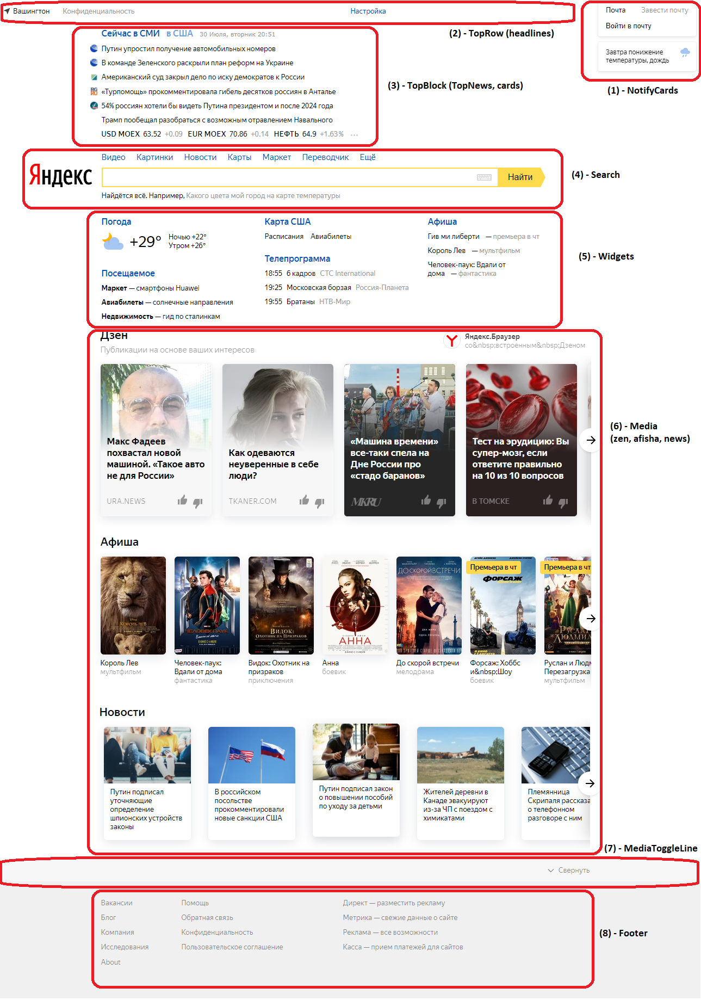

## 5.2 - Декомпозиция (Яндекс)

### Общие сведения

Информация по кструктуре проекта:
* `public` - статические данные (сама страница index.html, картинки, CSS-стили, иконки и пр.)
* `src` - исходные коды
  *  `src/App.js` - самый главный файл проекта
  *  `components/cards` - компоненты-карточки (правый верхний угол страницы)
  *  `components/headlines` - компоненты верхней строки меню
  *  `components/media` - компоненты медиа-блока
  *  `components/widget` - компоненты виджетов (тематических блоков)
  *  `components/public` - компоненты общего использования
  *  `Layouts` - оберточные компоненты, создающие структуру страницы
  *  `const` - константы, входные данные для всех компонентов

**ВСЕ компоненты используют ТОЛЬКО входные данные!** Они берутся из констант ([src/const](src/const)).

## Структура страницы
 На рисунке описаны выделенные области ([рисунок](screenshot_marked.png))

### 1 - NotifyCards - правое меню
Все компоненты в разделе cards:
* `UserInfo` ([/src/components/cards/UserInfo](src/components/cards/UserInfo))
* `WeatherCard` ([/src/components/cards/Weather](src/components/cards/Weather))

### 2 - TopRow - верхняя строка меню
Все компоненты в разделе headlines:
* `City` ([/src/components/headlines/City](src/components/headlines/City))
* `MenuBar` ([/src/components/headlines/MenuBar](src/components/headlines/MenuBar))
  * меню `Settings` ([/src/components/headlines/Settings](src/components/headlines/Settings))

### 3 - TopBlock - верхний блок
Все компоненты в корневом разделе (src/components) и в разделе карточек (/src/components/cards):
* `TopNews` ([/src/components/TopNews](src/components/TopNews))
  * использует `NewsCard`(новости) ([/src/components/cards/NewsCard](src/components/cards/NewsCard))
    * `StaticList` - список новостей
    * `AnimatedList` - список сменяющихся новостей в одной строке - **!!вот тут проболема - не работает!!** 
  * использует `Stockings`(котировки) ([/src/components/cards/Stockings](src/components/cards/Stockings))

### 4 - Search - строка поиска
Все компоненты в корневом разделе (src/components/Search):
* `Search` ([/src/components/Search](src/components/Search))
    * `SearchLogo` - картинка поиска
    * `SearchBlock` - форма поиска
      * `ServiceLinks` - ссылки сверху строки поиска
      * `SearchForm` - сама строка поиска(форма)
      * `SearchExampleRow` - пример поиска

### 5 - Widgets - блоки с тематической информацией
Все компоненты в разделе widgets (src/components/widgets):
* `WeatherWidget` - прогноз погоды ([/src/components/widgets/Weather](src/components/widgets/Weather))
* `Services` - посещаемые сервисы Яндекс ([/src/components/widgets/Services](src/components/widgets/Services))
* `Region` - карта региона ([/src/components/widgets/Region](src/components/widgets/Region))
* `Programme` - ТВ-программа ([/src/components/widgets/Programme](src/components/widgets/Programme))
* `Afisha` - новинки кино ([/src/components/widgets/Afisha](src/components/widgets/Afisha))

### 6 - Media - медиа-блоки
Все компоненты в разделе media (src/components/media):
* `Zen` - лента Дзен ([/src/components/media/Zen](src/components/media/Zen))
* `AfishaMedia` - лента новинок кино ([/src/components/media/Afisha](src/components/media/Afisha))
* `NewsMedia` - лента новостей ([/src/components/media/News](src/components/media/News))
Все компоненты используют `DefaultMedia`. А компоненты карусели(Carousel) используют типовой `DefaultCarousel`. В качестве параметра `DefaultCarousel` принимает компонент, который отображает один элемент(item). Например, `ZenItem`, `AfishaItem`, `NewsItem`.

### 7 - MediaToggleLine - разделительная линия медиа-блока
Все компоненты в разделе media (src/components/media):
* `MediaToggleLine` - разделительная линия ([/src/components/media/MediaToggleLine](src/components/media/MediaToggleLine))

### 8 - Footer - нижняя часть страницы
Все компоненты в корневом разделе src/components/Footer:
* используется `LinksLayout` - для разбиения множества ссылок на столбцы ([src/components/Footer](src/components/Footer))
  * используется типовой `DefaultLinks` - отображает список ссылок ([src/components/Footer](src/components/Footer))

