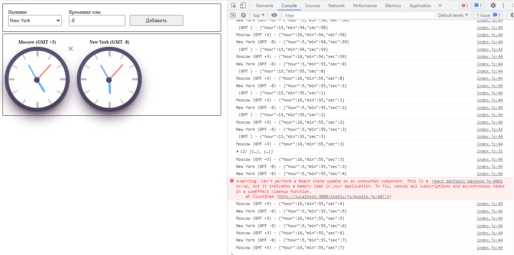

## 6.1 - Часы
Используемые компоненты:
`Clocks` ([src/components/Clocks](src/components/Clocks)) - основной компонент
* `ClockForm` ([src/components/ClockForm](src/components/ClockForm)) - форма выбора города и часового пояса
* `ClockData` ([src/components/ClockData](src/components/ClockData)) - область отображения часов
  * `ClockItem` ([src/components/ClockItem](src/components/ClockItem)) - отображение одних часов с заданным часовым поясом

### ОШИБКА!
При __первом__ удалении __первых__ часов возникает ошибка как на картинке:

*Warning: Can't perform a React state update on an unmounted component. This is a no-op, but it indicates a memory leak in your application. To fix, cancel all subscriptions and asynchronous tasks in a useEffect cleanup function.
    at ClockItem (http://localhost:3000/static/js/bundle.js:407:5)*

Как её исправить?
